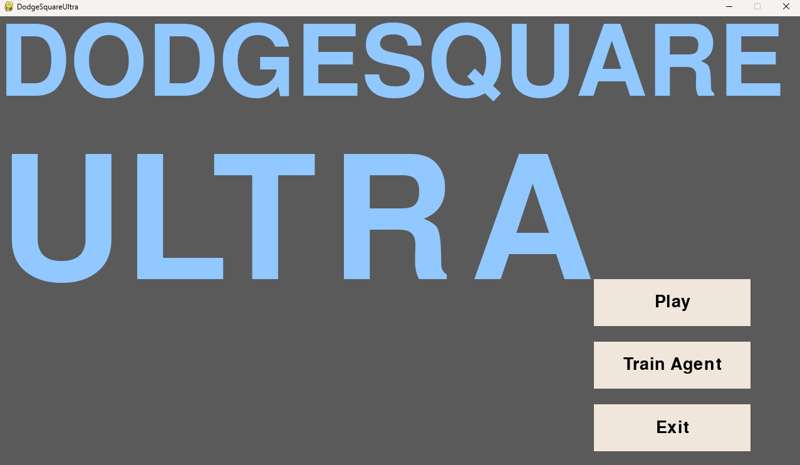

This small project is a simple 2D survival game built with Python, which includes two main components:
1.  A **human-playable version** of the game.
2.  A **Reinforcement Learning agent** built with PyTorch that can be trained to play the game autonomously.

The user can select between the two modes in the main menu, as shown below:


Here's a demo:


To run the game:
```bash
python main.py