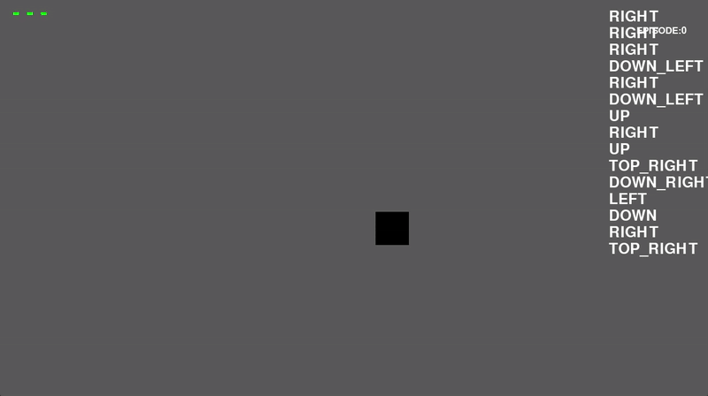

Simple dodgeball game built using Pygame based on mouse click movements. With the wish to learn more about RL and Pytorch, built an RL agent constructed using Q-DeepLearning, which *hopefully* learns to play the game through many episodes.
Here's a demo:

